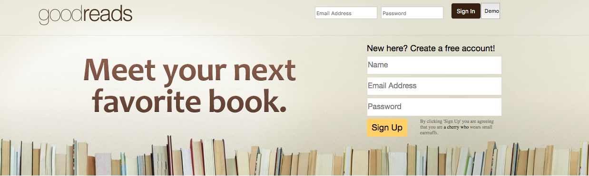
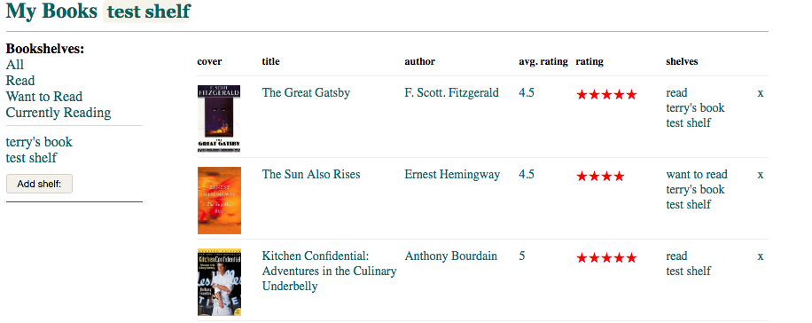
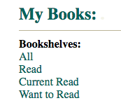
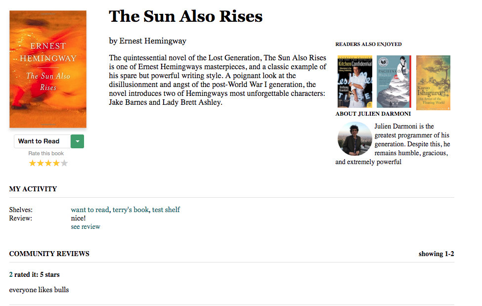

# GoodLivres

GoodLivres is a single page social media application for books. Find your favorite reads and add them to custom bookshelves.   

# Key Features 

## User Profiles 

Users can sign in, sign up or use the demo login to try the website. 

After signing in, they are taking to their 'My Books' page.

## Bookshelves 

Users can add bookshelves and select the 'Current Bookshelf'. The Current Bookshelf will display it's associated books.

Each user starts with 4 default bookshelves: 'Read', 'Currently Reading, 'Want to Read', and 'All'.

<!--  -->

## Books 

Users can visit book show pages. On the show page, users can see information about the book, and add it to any bookshelf on their profile.

Once they add the book, they will be able to see it reflected in 'My Books'.

## All Books page

Clicking 'Browse' takes you to the Books Index page, where all the seeded books are displayed. Books can be added from the index or their individual show pages.

<!--  -->
